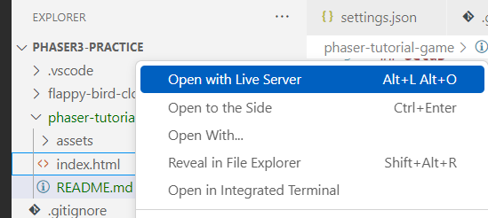

# phaser-tutorial-game

## Setup

1. If you don’t have Node.js installed, [install it from here](https://nodejs.org/en/) (Node.js version >= 14.6.0 required)

2. Navigate into the project directory

```bash
  $ cd phaser-tutorial-game
```
3. Run the app by right-clicking on the ```index.html``` file and click 'Open with Live Server'.




